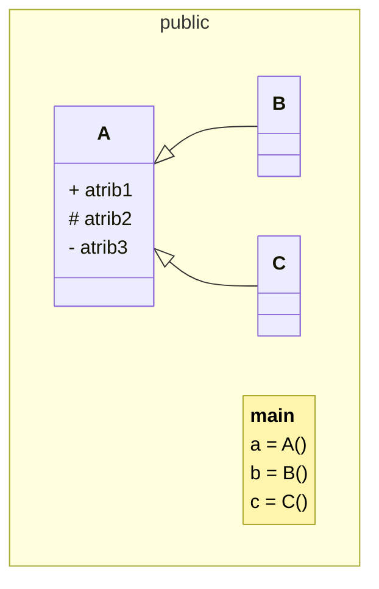
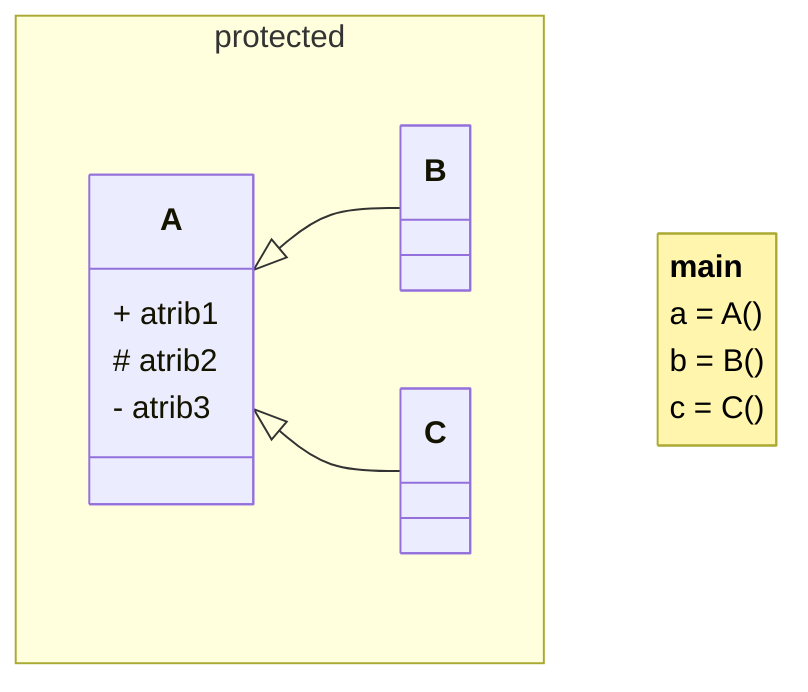
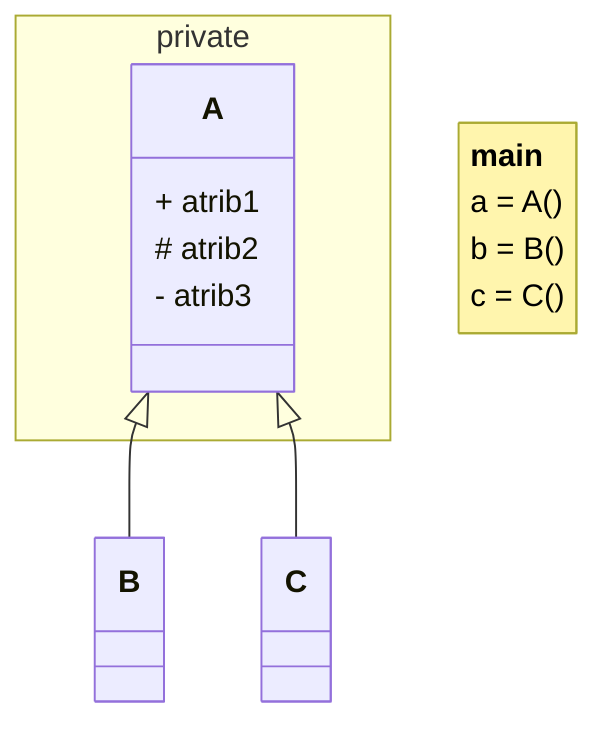

# Fase 10

## Tópicos abordados na Aula

- 00:00 - Encapsulamento  
- 00:27 - Perigo dos atributos públicos  
- 01:10 - O que é atributo protegido (_underline)  
- 02:10 - O que é atributo privado (__duplo underline)  
- 03:20 - Diferença entre teoria e prática em POO  
- 04:00 - Python NÃO segue visibilidade rígida  
- 05:00 - Filosofia "Consenting Adults" (adultos consentindo)  
- 06:30 - Convenções ao invés de regras  
- 08:00 - Como Python trata acesso aos atributos  
- 09:30 - Nomenclatura correta no Python (_ e __)  
- 11:00 - Name Mangling explicado  
- 13:00 - Criando atributos público, protegido e privado  
- 15:00 - Testando na prática (código real)  
- 17:00 - Problema com atributos protegidos sendo alterados  
- 19:00 - Criando atributos “falsos” sem perceber  
- 21:00 - Como acessar atributos protegidos corretamente  
- 23:00 - Acessando atributos privados (mesmo sendo “proibido”)  
- 25:00 - Por que isso é considerado errado na prática  
- 27:00 - Filosofia Python na prática  
- 29:00 - Boas práticas e erros de programador iniciante  
- 31:00 - Conclusão da aula  
- 32:00 - Próxima aula: Properties (getters e setters)

---

## Perguntas:

- O que significa **encapsulamento**?
- Quais são as **vantagens** de **proteger** os objetos?
- É verdade que o **Python** **não protege** nada?
- Como implementar **visibilidade** de **atributos**
- O que é **name mangling**?

---

## Fase 10 - Encapsulando objetos e protegendo tudo - Parte 1

### Os 4 pilares da Programação Orientada a Objetos

- Abstração
- Encapsulamento
- Herança
- Poliformismo

---

### Encapsulamento

> Visa manter a **integridade** do sistema, *protegendo* o **estado interno** do objeto contra *interferência* externa não regulamentada.

---

### Exemplos

Ex.: Sobre o controle remoto... O que fazemos para **proteger** os **circuitos** e **componentes** internos?

Envolvemos ele em uma **"cápsula"** que deixa **exposto** apenas o que é **acessível**.

Ex.: Quando você vai tomar um remédio.. Qual é o **objetivo** em usar uma **cápsula** gelatinosa nos **remédios**?

- **isola** a dose exata dos **compostos**
- **impede** a ação dos fatores **externos** (umidade, luz, ...)
- **protege** o paciente do gosto **amargo** e **toxicidade** direta

---

### Principais vantagens:

- segurança e controle
- facilidade e manutenção
- flexibilidade e reutilização
- redução de efeitos colaterais

---

### Para realizar essa proteção, precisamos entender:

- visibilidade dos atributos
- acesso aos dados protegidos

---

### Visibilidade

Existem **três tipos** de **visibilidade** para atributos em linnguagem **POO**:

- public +
- protected #
- private -

---

#### + public

O atrib1 está disponível dentro do retângulo (escopo), ele é acessível dentro do retângulo todo, ou seja é disponível para a superclasse, para todas as suas subclasses e qualquer lugar fora delas.

---

#### # protected

O atrib2 está disponível dentro do retângulo (escopo), ele é acessível dentro do retângulo todo, ou seja é disponível para a superclasse, para todas as suas subclasses.

---

#### - private

O atrib3 está disponível somente dentro do retângulo (escopo), ele é acessível somente para a superclasse.

---

Porém, o Python não considera visibilidade da mesma forma que outras linguagens de programação!

Na verdade essa visibilidade existe no python, dá para **proteger o código** no python **SIM**, porém o escopo de visibilidade é **sempre público**.

---

### Consenting Adults

O python não trabalha com regras rígidas, ele trabalha com uma convenção muito importante, **Consenting Adults.**

Liberdade com responsabilidade!

### Filosofia pythonica

> No lugar de criar barreiras concretas de modificadores de acesso, os desenvolvedores vão preferir estabelecer uma série de convenções que indicam como o acesso a esses elementos deve ser realizado.

### Atributos

## Público
\+ atrib1

## Protegido
\# _atrib2

## Privado
\- __atrib3