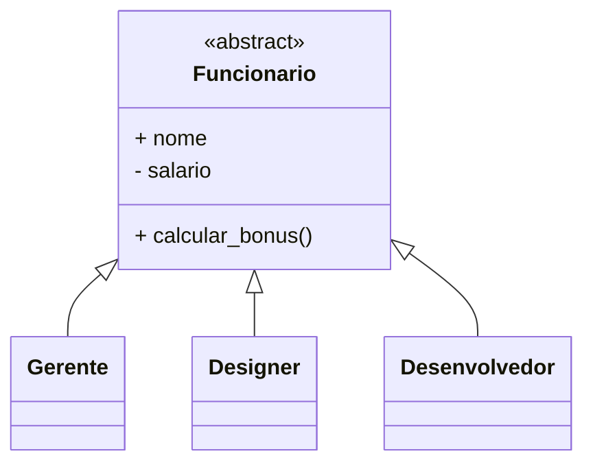
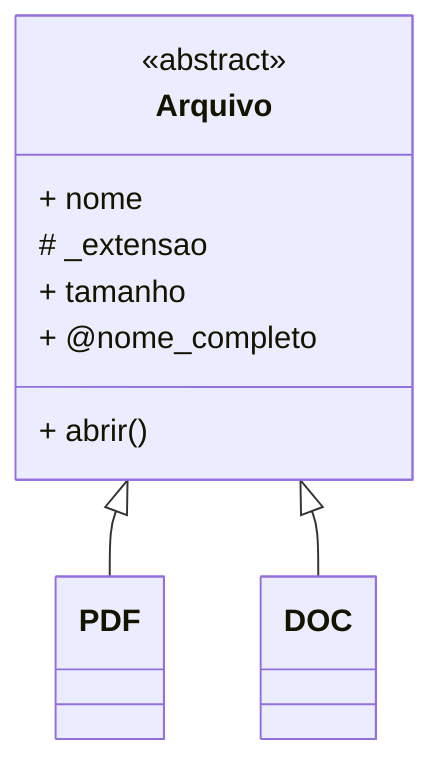
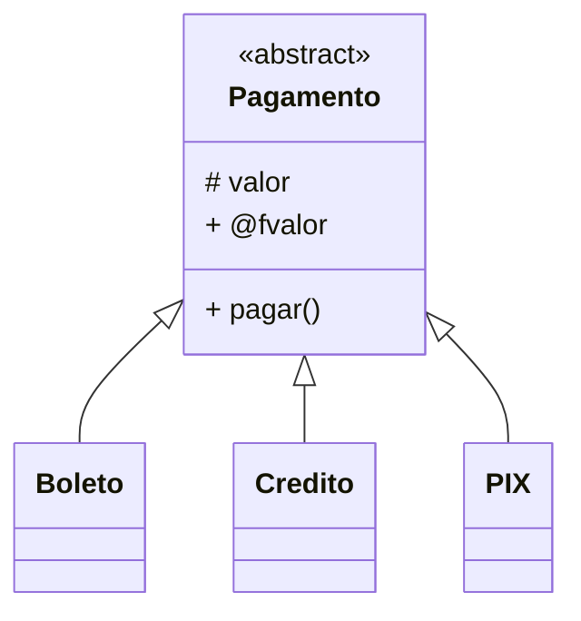
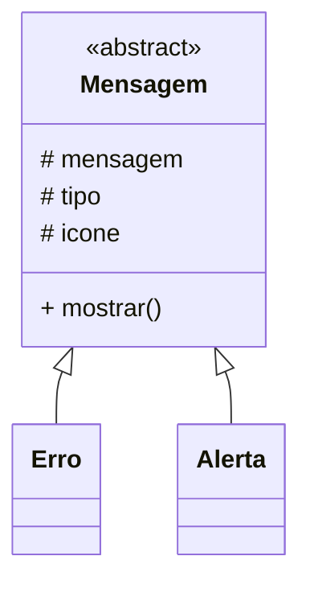
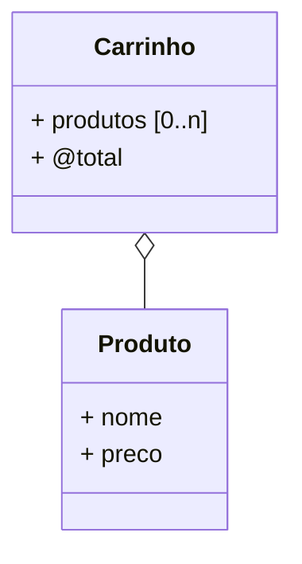
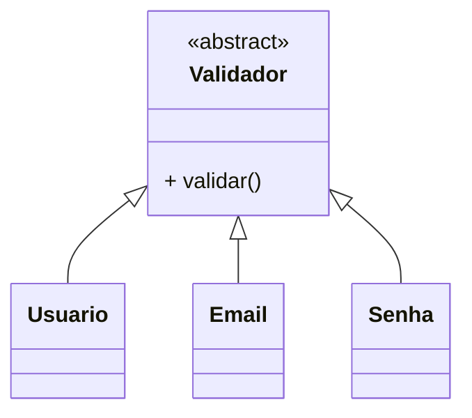
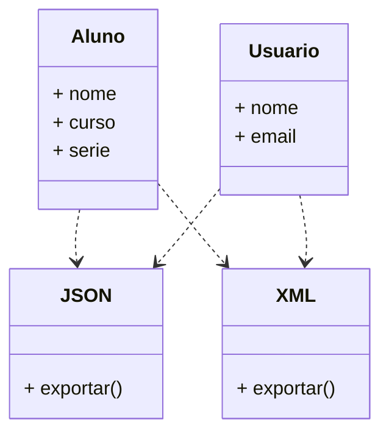

# Fase 15

## Tópicos abordados na Aula

- 0:00 - Introdução aos 7 desafios de Polimorfismo
- 2:37 - Desafio 34: Funcionários e cálculo de bônus
- 2:53 - Criando a classe abstrata Funcionário
- 3:34 - Subclasses Gerente, Designer e Desenvolvedor
- 3:51 - Polimorfismo no cálculo de bônus
- 4:08 - Diferentes percentuais para cada funcionário
- 4:28 - Demonstração do Desafio 34
- 5:00 - Calculando bônus de acordo com a classe
- 5:49 - Alteração e proteção do salário
- 6:54 - Desafio 35: Simulador de abertura de arquivos
- 7:38 - Classe abstrata Arquivo e método abrir
- 8:02 - Subclasses PDF e DOC
- 8:21 - Abrindo diferentes tipos de arquivos
- 0:05 - Método polimórfico para abrir arquivos
- 0:40 - Desafio 36: Simulador de pagamentos
- 0:56 - Classe abstrata Pagamento
- 1:22 - Boleto, cartão de crédito e Pix
- 1:40 - Método polimórfico finalizar compra
- 2:07 - Formatação de valores e localização
- 3:09 - Desafio 37: Sistema de mensageria
- 3:36 - Superclasse Mensagem e subclasses
- 4:03 - Mensagens de aviso, alerta e erro
- 5:15 - Método mostrar funcionando de forma polimórfica
- 5:37 - Desafio 38: Carrinho de compras e agregação
- 6:07 - Diferença entre associação, composição e agregação
- 6:19 - Sobrecarga do operador +
- 7:10 - Adicionando produtos ao carrinho
- 8:07 - Somando carrinhos de compras
- 9:14 - Desafio 39: Validação de dados
- 9:44 - Classe abstrata Validador
- 0:01 - Validando usuário, e-mail e senha
- 1:45 - Método polimórfico validar
- 2:33 - Validação de e-mail e senha
- 4:05 - Expressões regulares (Regex) em Python
- 5:32 - Desafio 40: Exportação de dados
- 5:40 - Relação de dependência entre classes
- 5:48 - Exportação de dados em JSON e XML
- 7:21 - Criando listas de usuários
- 8:04 - Exportando dados para XML
- 8:51 - Polimorfismo com JSON e XML
- 9:09 - Exportando dados de alunos
- 9:47 - Mesmo método para diferentes tipos de dados
- 0:35 - Os desafios mais complexos da bateria
- 0:49 - Revisão dos quatro pilares da POO
- 1:13 - Associação, agregação, composição e dependência
- 1:19 - Conceitos extras dos desafios
- 1:59 - Próximas resoluções de Polimorfismo

---

## Fase 15 - Hora dos Desafios! - Polimorfismo

### Desafio 034

- crie a seguinte estrutura de classes para calcular bônus salarial
- bônus desenvolvedor: 10%
- bônus designer: 8%
- bônus gerente: 15%

---

## Desafio 35

- crie um simulador que gerencie a abertura de diferentes tipos de arquivos

---

## Desafio 36

- crie um simulador que gerencie pagamentos em diferentes tipos

---

## Desafio 37

- implemente um sistema de mensagens padronizados usando orientação a objetos

---

## Desafio 38

- implemente a seguinte estrutura com agregação, incluindo sobrecarga do operador + para adicionar produtos ao carrinho de compras

---

## Desafio 39

- crie classes para validadores de dados, com os exemplos a seguir:

**Usuario:**
- de 5 a 20 caracteres
- suporta letras minúsuclas
- suporta números
- pode ter símbolo de sublinhado

**Senha:**
- pelo menos 8 caracteres
- pelo menos uma maiúscula
- pelo menos um símbolo

**Email:**
- deve conter uma única @
- usuário pode conter letras, números e alguns símbolos
- os domínios contém pontos
- o TLD encerra com ponto e pelo menos 2 letras

---

## Desafio 40

- implemente um exportador de dados funcional para JSON e XML

