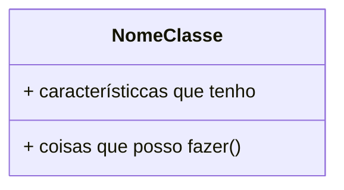
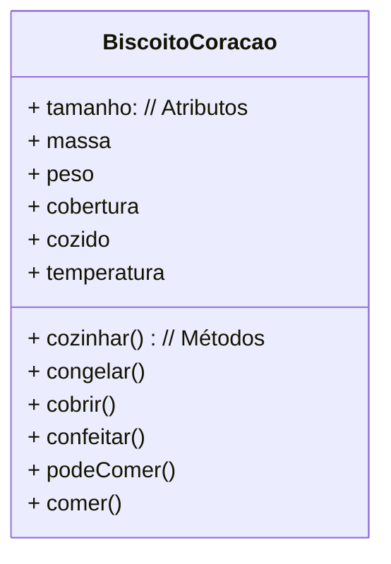

# Fase 03

## Tópicos abordados na Aula

- 00:00 - Introdução e Perguntas Iniciais 
- 00:58 - Fundamentos da Programação Orientada a Objetos 
- 03:35 - O Exemplo Prático do Biscoito e da Forminha 
- 05:05 - O Conceito de Classe na Programação 
- 07:48 - Entendendo o Diagrama de Classes UML 
- 09:23 - Atributos e Métodos na Prática 
- 12:44 - O que é Instanciamento (Instância) 
- 14:52 - Definição Técnica de Objeto 
- 16:16 - O que é o Estado de um Objeto 
- 18:09 - Exemplos de Objetos Abstratos 
- 21:12 - Desafios e Exercícios de Fixação

---

## Perguntas

- O que é um `objeto`?
- O que é uma `classe`?
- Quando acontece um `instanciamento`?
- Sabe definir o `estado` de um objeto?

---

## Fase 03 - O que são Objetos e Classes?

"Um **objeto** é uma **instância** de uma **classe**."

---

## Objeto:

> "Coisa **material** ou **abstrata** que é feita a partir de um **modelo** e pode ser descrito por meio das suas **características**, **comportamentos** e **estado** atual."

---

## Objetos Abstratos?

- Uma `consulta` marcada no médico
- Um processo de `venda`
- Um `compromisso` ou `reunião`
- Uma `aula` na faculdade
- Uma `transação bancária`
- Uma `reserva` de voo
- Um `erro` no sistema
