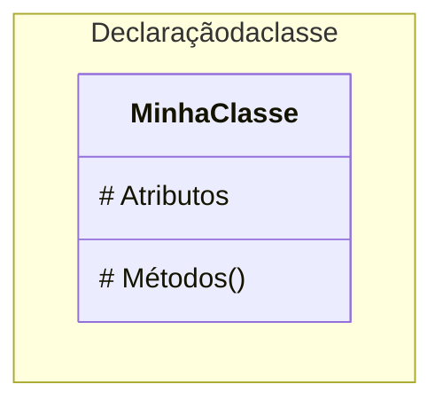
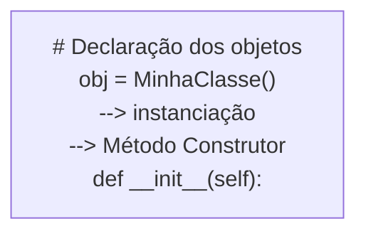

# Fase 04

## Tópicos abordados na Aula

- 00:00 - Perguntas iniciais e objetivos da aula
- 01:31 - Objetos como variáveis evoluídas (introdução teórica)
- 03:00 - Revisão da evolução das variáveis até chegar aos objetos
- 11:37 - O que realmente é um objeto na prática
- 19:36 - Criando o arquivo do exercício e estrutura do código
- 20:05 - Criando a classe Gafanhoto
- 20:16 - Método construtor _init_
- 20:46 - Atributos de instância (nome e idade)
- 21:30 - Criando métodos de instância
- 22:17 - Método aniversario()
- 23:05 - Método mensagem()
- 24:36 - Instanciando o objeto e explicação do construtor
- 25:38 - Atribuindo valores aos atributos do objeto
- 26:06 - Diferença entre atributo e método
- 27:15 - Testando o método aniversário
- 27:38 - Criando dois objetos (G1 e G2)
- 28:20 - Entendendo o papel do self
- 29:00 - Encerramento e consolidação dos conceitos

---

## Perguntas

- Qual é a diferença entre **objeto** e **variável**?
- Quando vamos colocar a **mão na massa**?
- Como faço para declarar uma **classe**?
- Como instanciar im **objeto** a partir de uma **classe**?

---

## Fase 04 - Os objetos são variáveis evoluídas

Você já sabe como funciona uma **variável simples**.

A partir daí, surgiram as **variáveis compostas**.

Depois vieram os **dicionários** com seus **elementos nomeados**.

O maior problema é a **separação** entre **dados** e **funções**.

O ideal seria permitir que a **variável** execute **funcionalidades internas**.

---

## Objeto

Em outras palavras, **objetos** são **variáveis** que, além de guardar **dados**, podem **fazer** **coisas** com esses dados.

---

Vamos **finalmente** colocar a **mão na massa**?

