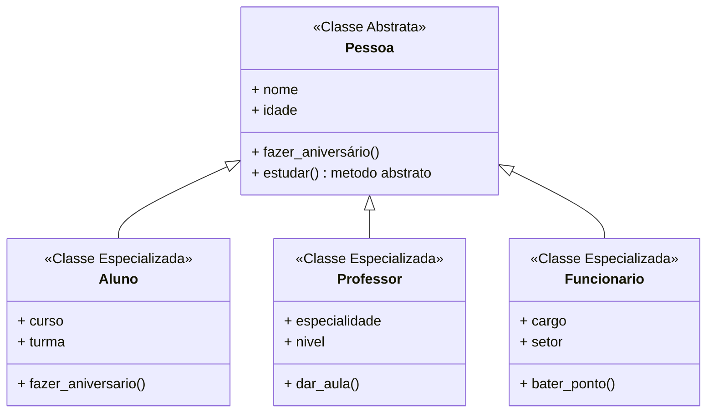

# Fase 08

## Tópicos abordados na Aula

- 00:00 - Você realmente entende abstração?
- 00:18 - Por que abstração é o pilar mais ignorado
- 00:32 - Revisão rápida: onde entra a abstração
- 00:50 - Ligando herança com abstração (visão real)
- 01:12 - Interface pública: o conceito que muda tudo
- 01:45 - O que é abstração de verdade (sem enrolação)
- 02:20 - Ignorar o irrelevante (mentalidade de dev)
- 03:00 - Exemplo simples que clareia tudo
- 03:40 - Abstração no mundo real (analogia prática)
- 04:20 - Quando usar abstração no código
- 05:10 - Erro comum ao tentar abstrair cedo demais
- 06:05 - Preparando para a prática em Python
- 07:10 - Introdução ao módulo ABC
- 08:00 - O que é uma classe abstrata
- 09:05 - Criando sua primeira classe abstrata
- 10:20 - Métodos abstratos na prática
- 11:40 - Diferença: método abstrato vs concreto
- 13:00 - Regras importantes das classes abstratas
- 14:20 - Forçando implementação nas subclasses
- 16:00 - Exemplo completo funcionando
- 18:30 - Erro comum usando ABC (e como evitar)
- 20:10 - Refatorando código com abstração
- 22:00 - Quando NÃO usar abstração
- 24:00 - Revisão geral (fixando o conceito)
- 26:14 - Início da prática completa
- 27:30 - Construindo passo a passo
- 29:00 - Testando o comportamento
- 30:00 - Conclusão + próximo nível da POO

---

## Perguntas:

- O que é **abstração**?
- O que é **interface pública**?
- O que é uma **classe abstrata**?
- O que é um **método abstrato**?
- Você conhece as siglas **ABC** e **DRY**?

---

## Fase 08 - Trabalhando com coisas abstratas

### Os 4 pilares da Programação Orientada a Objetos

- Abstração
- Encapsulamento
- Herança
- Poliformismo

### Abstração

> É a prática de **ignorar** o **irrelevante** e se **focar** estritamente no **essencial**.

O que e necessário para saber usar um **controle remoto**?

Você conhece o funcionamento dos circuitos, sensores e alimentação?

"Mas não precisa! Basta saber o que cada botão faz!"

O nome disso é **abstração**!

Dessa maneira, o usuário não precisa saber detalhes da **implementação**...

... e passa a se focar apenas na **interface pública** que está disponível.

---

#### Principais vantagens:

- Maior legibilidade
- Padronização
- Simplificação
- Segurança

---

Existe **abstração de dados**, que acontece quando **ignoramos** **informações desnecessárias** para o escopo do projeto.

Existe a **abstração de processos**, quando não precisamos saber *como um método faz* seu trabalho, apenas saber que *ele existe* pela **interface**.

---



---

Uma **classe abstrata** *nunca será instanciada*, já que ela será usada apenas como base para as **subclasses**.

Ao definir um conjunto de **métodos abstratos**, dizemos que estamos criando a **interface pública** da **classe**.

Uma **classe abstrata** pode ter *métodos abstratos* que deverão ser *obrigatoriamente* implementados nas **subclasses**.

Mas uma **classe abstrata** pode ter **métodos concretos** se eles funcionarem da mesma maneira para todas as *subclasses* (**DRY**).

---

#### Abstract Base Classes

```python
from abc import ABC, abstractmethod

class Pessoa(ABC):
    def __init__(self, nome="", idade=0)
    self.nome = nome
    self.idade = idade

    def fazer_aniversario(self):
        self.idade += 1

    @abstractmethod
    def estudar(self):
        pass
```