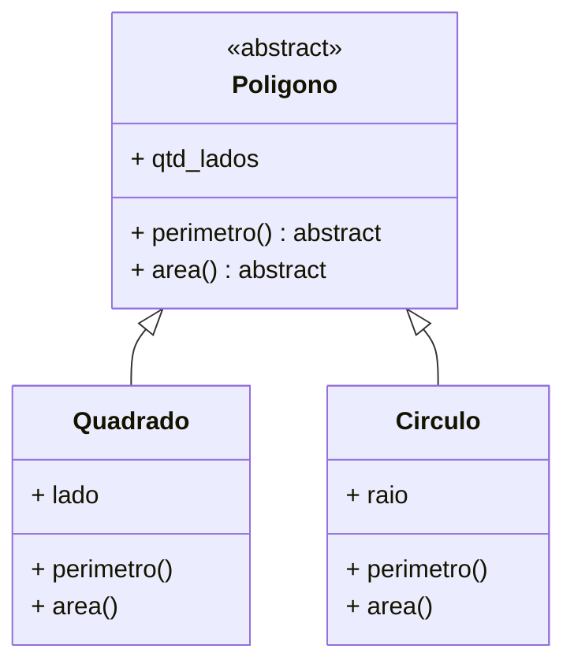
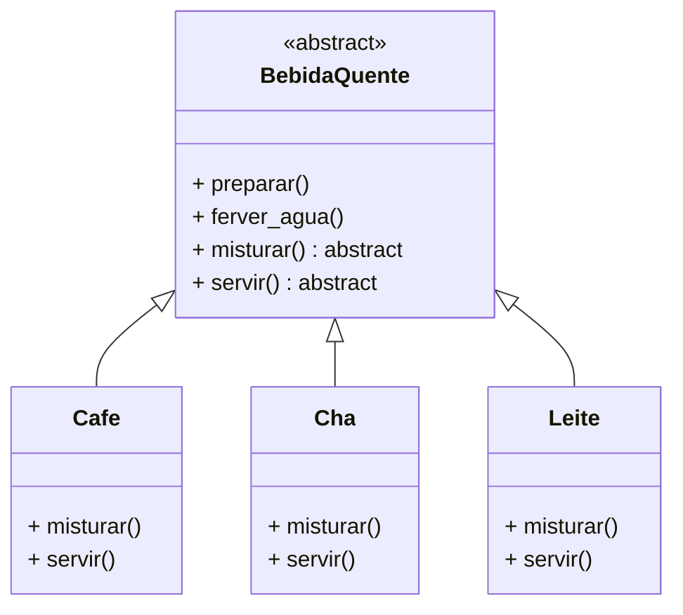
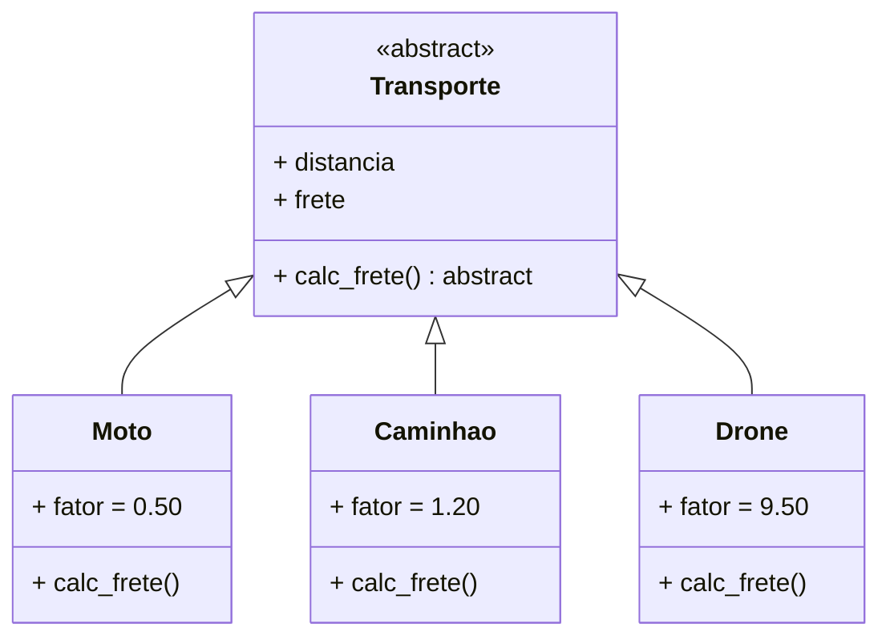
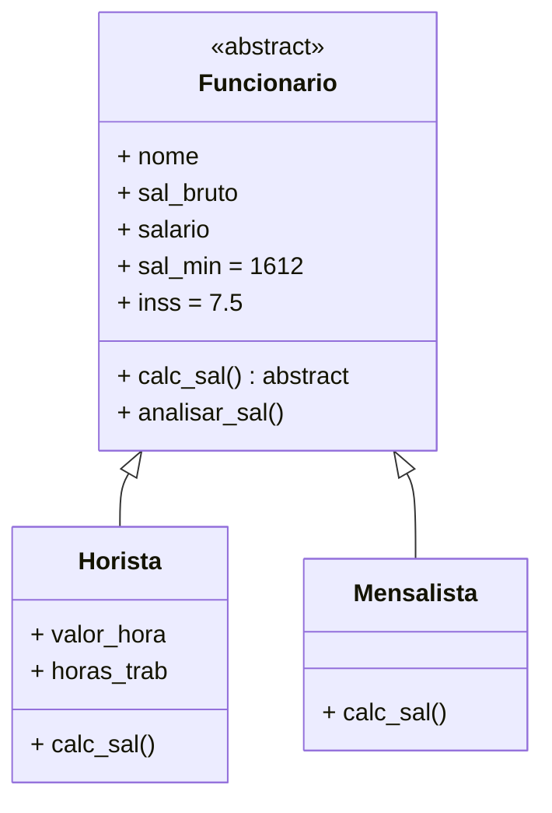
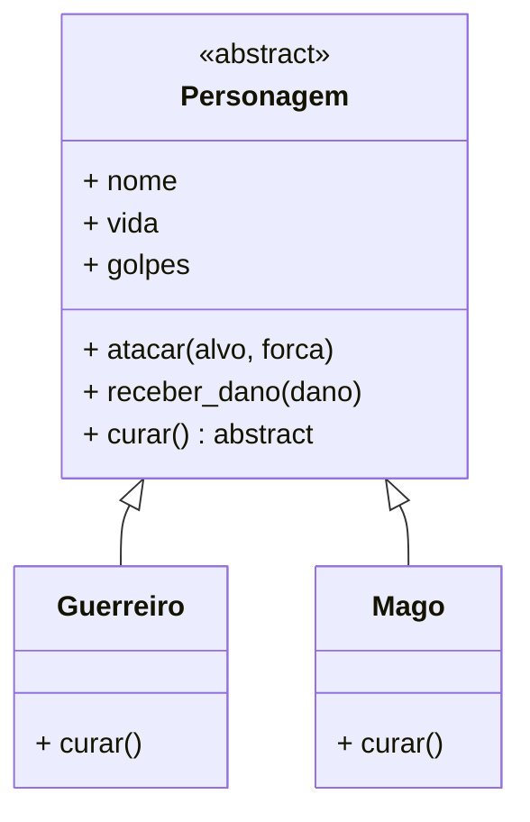

# Fase 09

## Tópicos abordados na Aula

- 00:00 - Chegou a hora do teste (5 desafios de POO)
- 00:05 - Você realmente aprendeu herança e abstração?
- 00:26 - Introdução à aula + o que você vai enfrentar
- 00:46 - Revisão rápida: herança + abstração
- 01:02 - Exercícios são simples… mas não fáceis
- 01:28 - Regra de ouro: NÃO copie, tente antes
- 02:01 - Antes de começar (mentalidade correta)
- 02:05 - Academia Hostnet
- 03:18 - Desafio 1: classe abstrata Polígono
- 04:00 - Métodos abstratos: área e perímetro
- 05:28 - Testando com quadrado e círculo
- 06:04 - Como estruturar o código corretamente
- 06:26 - Desafio 2: cafeteira orientada a objetos
- 07:00 - Classe mãe: bebida quente
- 07:30 - Métodos concretos vs abstratos
- 08:37 - Diferença entre café, chá e leite
- 09:00 - Fluxo automático de métodos (sem if)
- 16:44 - Desafio 3: sistema de funcionários
- 17:15 - Horista vs mensalista (conceito chave)
- 17:45 - Cálculo de salário na prática
- 18:24 - Análise de salário funcionando
- 19:00 - Desafio 4: estrutura completa de funcionários
- 19:30 - Aplicando herança corretamente
- 19:59 - Desafio 5: sistema de batalha RPG
- 20:30 - Ataque, dano e lógica de combate
- 21:30 - Sistema de cura com variações
- 23:08 - Diferença entre classes (mago vs guerreiro)
- 23:49 - Recado importante (apoio ao projeto)
- 24:22 - Hora de praticar
- 25:00 - Próximo passo: encapsulamento

---

## Fase 09 - Hora dos Desafios! - Abstração e Herança

### Desafio 023

- implemente o seguinte diagrama de classes:

---

### Desafio 024

- simule uma cafeteira orientada a objetos

---

### Desafio 025

- crie classes capazes de calcilar fretes de veículos diferentes

---

### Desafio 026

- crie a estrutura capaz de calcular salarios de funcionarios diferentes

---

### Desafio 026

- simule o sistema de batalha entre personagens de um RPG

---
