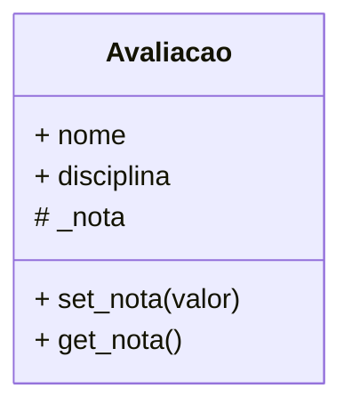
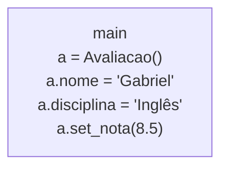
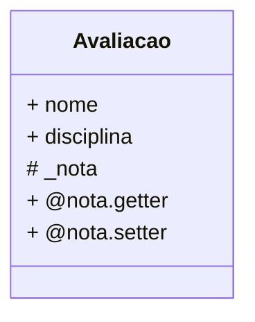
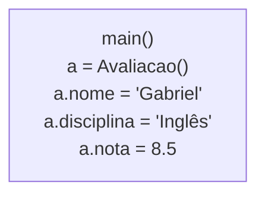

# Fase 11

## Tópicos abordados na Aula

- 00:00 - Introdução à Aula 11
- 00:08 - Objetivo da aula (acesso a dados)
- 00:53 - Apresentação do professor
- 01:14 - Revisão do encapsulamento
- 03:25 - Conceito de encapsulamento
- 04:43 - Problemas sem proteção de dados
- 06:06 - Métodos acessores (Getters e Setters)
- 07:01 - Duas formas de acessar dados
- 08:33 - Exemplo prático (classe Avaliação)
- 10:23 - Criando projeto no PyCharm
- 12:54 - Problema com atributos públicos
- 14:01 - Protegendo atributo com _
- 14:50 - Criando getters e setters
- 15:59 - Validação de dados (0 a 10)
- 17:24 - Funcionamento dos acessores
- 19:33 - Introdução ao @property
- 21:00 - Diferença prática (property vs métodos)
- 22:26 - Implementando @property
- 25:25 - Usando atributo validável
- 26:26 - Testando validações
- 27:10 - Getter, Setter e Deleter
- 28:16 - Comparação final das técnicas
- 29:00 - Conclusão da aula

---

## Perguntas:

- Como funciona o **acesso a dados** encapsulados?
- Como construir **métodos acessores**?
- Como usar o **decorador** **@property**?
- Qual é a **melhor** técnica de **acesso a dados** em python?

---

## Fase 11 - Encapsulando e dando acesso a dados - Parte 2

### Os 4 pilares da Programação Orientada a Objetos

- Abstração
- Encapsulamento
- Herança
- Poliformismo

---

### Encapsulamento

> Visa manter a **integridade** do sistema, *protegendo* o **estado interno** do objeto contra *interferência* externa não regulamentada.

---

### Conceitos importantes

- visibilidade dos atributos
- acesso aos dados protegidos

---

### Acesso aos dados

Existem duas maneiras de permitir o acesso aos dados encapsulados:

- uso de getters e setters
- uso de decorador @property

---

### Getters e Setters

---

### Decorador @property

