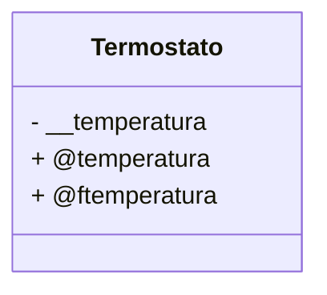
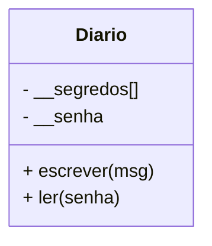
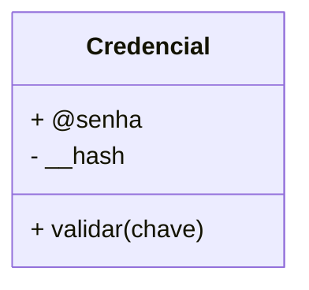
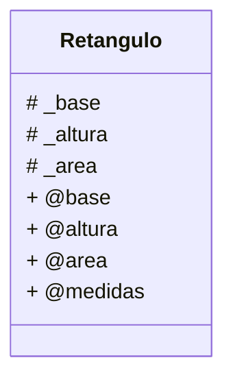
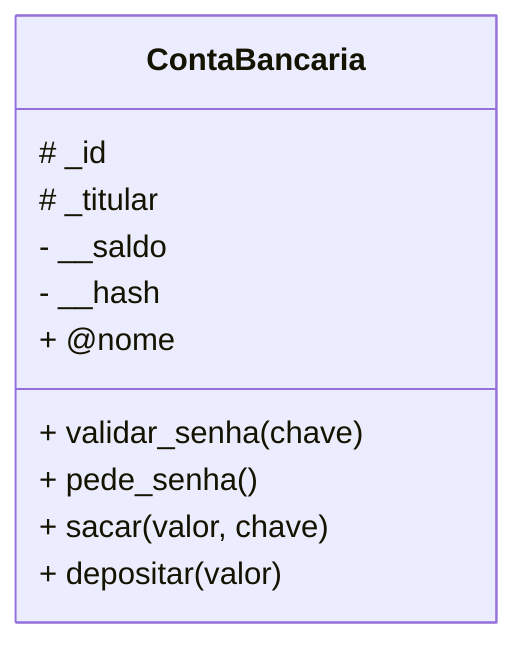
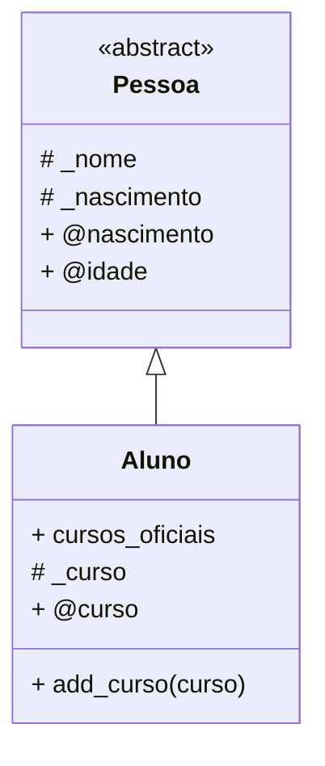

# Fase 12

## Tópicos abordados na Aula

- 00:00 - Introdução aos desafios de encapsulamento
- 00:01 - Importância da aula anterior e playlists completas
- 00:02 - Vantagens da plataforma Estudonauta
- 03:09 - Desafio 28: Termostato orientado a objetos
- 07:45 - Desafio 29: Diário secreto com senha
- 10:41 - Desafio 30: Criptografia SHA-256 em Python
- 14:15 - Desafio 31: Classe retângulo com validações
- 17:24 - Desafio 32: Conta bancária segura com senha
- 22:06 - Desafio 33: Herança + encapsulamento + abstração
- 26:13 - Convite para palestras e eventos
- 26:57 - Motivação para praticar os desafios
- 28:11 - Próximo tema: Polimorfismo em POO

---

## Fase 12 - Hora dos Desafios! - Encapsulamento

### Desafio 028

- implemente um termostato orientado a objetos

- características do termostato:
    - mínimo de 16 graus celsius
    - máximo de 30 graus celsius
    - quando ligado, ele fica em 24 graus celsius
    - quando girado, o incremento de temperatura é 0.5 graus celsius

---

### Desafio 029

- simule um diário secreto orientadoa objetos

---

### Desafio 030

- crie uma classe que gerencie a hash SHA256 de uma senha

---

### Desafio 031

- crie uma classe que represente um retângulo pelas suas medidas e área

---

### Desafio 032

- aprimore o exercicio da ContaBancaria, aplicando conceitos de encapsulamento

---

### Desafio 033

- implemente a seguinte estrutura de diagrama de classes

