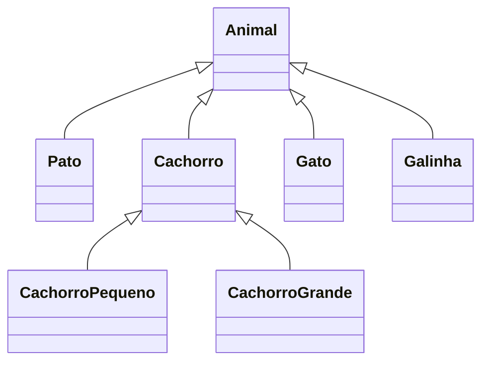
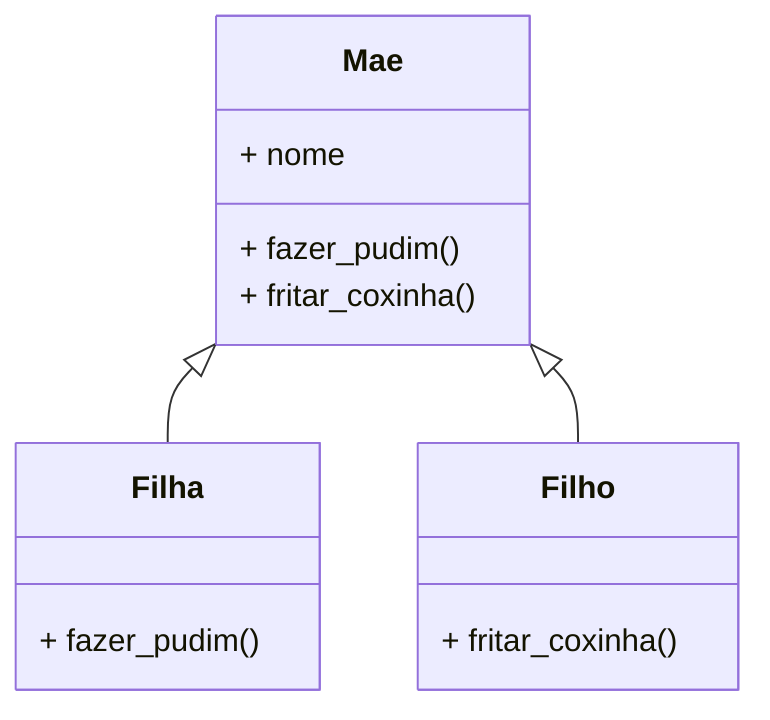

# Fase 13

## Tópicos abordados na Aula

- 00:00 - O que é Polimorfismo em Python?
- 01:23 - Introdução ao quarto pilar da POO
- 02:18 - Conceito de polimorfismo explicado
- 06:05 - O mesmo método com comportamentos diferentes
- 06:30 - Exemplo do pato (Duck Typing)
- 12:57 - Primeiros exemplos práticos em Python
- 23:20 - Polimorfismo de Inclusão (Override)
- 25:35 - Especializando subclasses com herança
- 29:00 - Override x Overload
- 30:10 - Quais tipos de polimorfismo o Python suporta?
- 31:22 - Override (Sobrescrita) na prática
- 31:45 - Exemplo com classes Mãe, Filha e Filho
- 37:30 - Sobrescrevendo métodos nas subclasses
- 39:00 - Entendendo o Overriding
- 40:00 - Revisão da aula e preparação para a Parte 2

---

## Perguntas:

- O que significa **poliformismo**?
- É **verdade** que é um conceito **difícil**?
- Quais são os **tipos** de poliformismo?
- O que é **override** e **overload**?
- O que o **pato tem a ver** com isso tudo?

---

## Fase 13 - Polimorfismo com Python - Parte 1

### Os 4 pilares da Programação Orientada a Objetos

- Abstração
- Encapsulamento
- Herança
- Poliformismo

---

### Poliformismo

> Propriedade ou estado daquilo que se **apresenta** e/ou se **comporta** de **várias formas** diferentes.

> "Um único nome, mas comportamentos diferetens."

---

### Exemplos:

Ex.:
- Pato
    - Pato.locomover("terra")
    - Pato.locomover("ar")
    - Pato.locomover("água")

E como seria isso no Python?

---

#### Function Overload

- len("Gustavo")
- len(["Sandy", "Junior"])
- len({"a":"x", "b":"y"})

#### Operator Overload

- \+ 5
- 5 + 4
- "Poli" + "morfismo"
- [3, 5] + [2, 4]

---

Ex.:

### Tipos de Polimorfismo

- Inclusão (Override / Subtyping)

É quando um método sobrescreve (override) um método da superclasse.

- Sobrecarga (Ad-hoc Overloading)

- Coerção (Ad-hoc Coercion)

- Paramétrico (Template / Generic)

> O Python só suporta os tipos de polimorfismo **Inclusão** e **Sobrecarga**.

- Método Polimórfico - Duck Typing

### Polimorfismo - Inclusão (Override)

