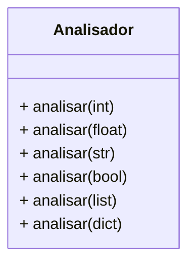
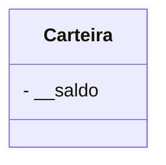

# Fase 14

## Tópicos abordados na Aula

- 00:00 - Introdução à Parte 2 de Polimorfismo
- 00:45 - O que será estudado nesta aula
- 03:21 - Revisão dos pilares da Programação Orientada a Objetos
- 04:17 - Revisão: Override, Overload e Duck Typing
- 05:05 - Introdução ao Overload (Sobrecarga)
- 06:50 - Por que Python não suporta sobrecarga de métodos nativamente
- 16:48 - Sobrecarga de operadores (Operator Overloading)
- 21:04 - Criando operadores personalizados na prática
- 22:05 - Métodos mágicos (__eq__, _lt__, __gt_ e outros)
- 23:36 - Personalizando o comportamento dos operadores
- 31:11 - Os tipos de polimorfismo suportados pelo Python
- 31:22 - Introdução ao Duck Typing
- 32:10 - Como o Duck Typing funciona na prática
- 36:17 - O princípio "Se parece um pato..."
- 40:14 - Exemplos reais de Duck Typing em Python
- 43:33 - Sobrescrevendo métodos especiais (__str__)
- 45:25 - Criando funções utilizando Duck Typing
- 48:11 - Aplicações práticas do Duck Typing
- 50:25 - Preparação para os exercícios de Polimorfismo

---

## Perguntas:

- Você viu a **aula anterior**?
- Mas e o **pato**?
- Como funciona **sobrecarga** na **prática**?
- Posso **personalizar** os **operadores**?

---

## Fase 14 - As várias formas de polimorfismo - Parte 2

### Os 4 pilares da Programação Orientada a Objetos

- Abstração
- Encapsulamento
- Herança
- Poliformismo

---

### Poliformismo

> Propriedade ou estado daquilo que se **apresenta** e/ou se **comporta** de **várias formas** diferentes.

> "Um único nome, mas comportamentos diferetens."

---

### Tipos de Polimorfismo

- Inclusão (Override / Subtyping)
- Sobrecarga (Ad-hoc Overloading)
- Coerção (Ad-hoc Coercion)
- Paramétrico (Template / Generic)
- Método Polimórfico - Duck Typing

---

> O Python só suporta os tipos de polimorfismo **Inclusão** e **Sobrecarga**.

- Método Polimórfico - Duck Typing

---

### Sobrecaraga de Método (Overload de Método)

- Não é reconhecido por padrão no Python, mas a gente consegue fazer ele ser suportado
- Métodos com todos nome, mas com assinaturas diferentes

---

---

## Sobrecarga de operador (Overload de Operador)

---

## Métodos mágicos para operadores

| Operação                 | Operador   | Método especial   |
| ------------------------ | ---------- | ----------------- |
| Equal to                 | `p1 == p2` | `p1.__eq__(p2)`   |
| Not equal to             | `p1 != p2` | `p1.__ne__(p2)`   |
| Less than                | `p1 < p2`  | `p1.__lt__(p2)`   |
| Less than or equal to    | `p1 <= p2` | `p1.__le__(p2)`   |
| Greater than             | `p1 > p2`  | `p1.__gt__(p2)`   |
| Greater than or equal to | `p1 >= p2` | `p1.__ge__(p2)`   |
| In-place Addition        | `p1 += p2` | `p1.__iadd__(p2)` |
| In-place Subtract        | `p1 -= p2` | `p1.__isub__(p2)` |

---

## Poliformismo "Duck Typing"

> "Se **parece** um **pato**, **nada** como um **pato**, **voa** como um **pato** e faz '**quack**', então provavelmente **é um pato**."

Esse é o **jeitinho** **Python** de ser!

> Não importa o tipo do objeto, o que importa é se ele sabe fazer alguma coisa.

---

### abrir()

- Porta
- LataAzeitona
- ContaBancaria
- Ovo
- Pacote
- Revista
- Empresa
- Cabeça

> "Mas eles não tem relação nenhuma entre eles!"

> **NÃO IMPORTA!**

Como seria esse **conceito** em **Python**?
